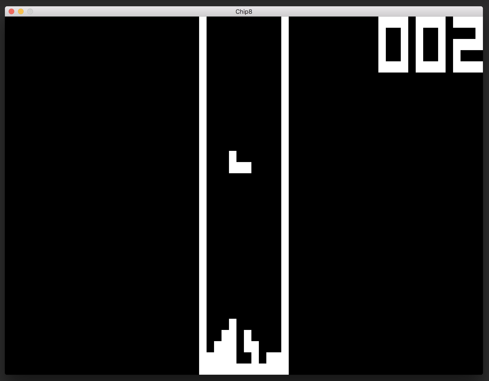

# CHIP-8

A [CHIP-8](https://en.wikipedia.org/wiki/CHIP-8) emulator implemented in [Go](https://golang.org/).

This project was based on [Laurence Muller](http://www.multigesture.net/about/)'s [tutorial](http://www.multigesture.net/articles/how-to-write-an-emulator-chip-8-interpreter/), and the opcode definitions listed on the CHIP-8 [Wikipedia article](https://en.wikipedia.org/wiki/CHIP-8).

Graphics and keyboard input are implemented using [Pixel](https://github.com/faiface/pixel).

Sound is output via [Oto](github.com/hajimehoshi/oto), with a [Wave Generator](github.com/theothertomelliott/wavegenerator) built as a supplementary project.

## Building/Installation

Some prerequisite libraries are needed for Pixel, see [Pixel requirements](https://github.com/faiface/pixel#requirements) for more details.

On Linux and FreeBSD, additional prerequesites will also be needed for audio, see the [Oto Readme](https://github.com/hajimehoshi/oto).

Once these prerequisites are installed, you can build and install this emulator using `go get`:

    $ go get -u github.com/theothertomelliott/chip8/cmd/chip8

## Usage

Assuming $GOPATH/bin is on your PATH, once installed, you can run the `chip8` binary at the commandline, specifying a ROM filename as argument:

    $ chip8 [path/to/rom.ch8]

For quick start, the Pong ROM has been included:

    $ cd $GOPATH/src/github.com/theothertomelliott/chip8
    $ chip8 data/pong.ch8

## Controls

The CHIP-8 keypad is mapped to the keys:

    1 2 3 4
    q w e r
    a s d f
    z x c v

Additional keyboard controls are as below:

* ESC - quit
* t - toggle trace logging on/off

